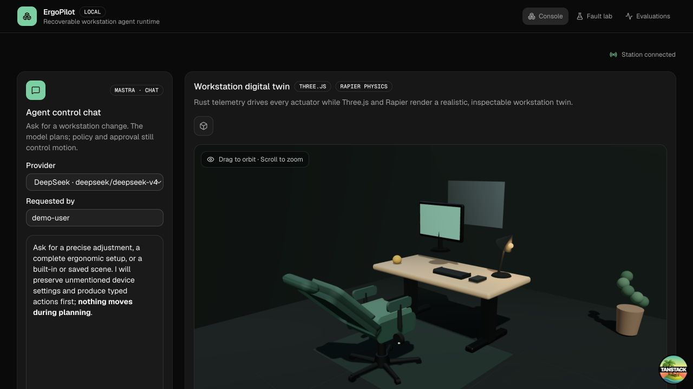
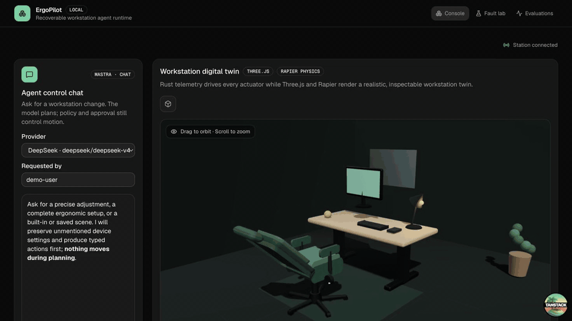

# ErgoPilot

[English](README.md) | **简体中文**

ErgoPilot 是一个面向模拟人体工学工作站的可恢复具身 Agent 运行时。它将类型化的工作目标转换为安全、可观测、可恢复的工作站动作，同时把策略判断和物理执行权保留在 LLM 之外。

这个项目刻意不做姿势建议聊天机器人。它要解决的核心工程问题，是如何在不可靠设备上可靠地执行动作：

- 语义化能力与版本化任务契约；
- 策略控制的动作与持久化人工审批；
- 幂等本地执行与动作后验证；
- 崩溃、断连和结果不确定时的恢复；
- 确定性测试与可检查的运行时间线。

实现计划和验收标准见 [docs/PROJECT_BLUEPRINT.md](docs/PROJECT_BLUEPRINT.md)。

## 演示



下面的短演示依次展示已验证的工作站状态、Office 场景预览、限定范围的四动作审批，以及配置完成后的状态。



[打开 6.5 秒 MP4 演示视频](docs/assets/ergopilot-demo.mp4) ·
[查看审批界面截图](docs/assets/ergopilot-approval.jpg)

## 当前纵向切片

本地 Rust 运行时、Hono API、TanStack Start 操作台和 Tauri 桌面工作站已经可以端到端运行。当前切片实现了：

- 严格、共享的 `TaskSpec` 和 `TaskRunView` JSON 契约；
- HMAC 签名的策略授权，绑定到唯一的运行、命令、动作和预期设备状态版本；
- 确定性的 `deny` 和 `require_approval` 决策；
- SQLite 中持久化的审批归属、过期时间、运行状态和有序事件；
- 仅请求者可执行的待审批任务取消，并与审批进行原子串行化，确保已取消的运行无法下发设备命令；
- 先持久化再产生副作用、幂等重放和写入后读取验证；
- 覆盖任务下发和命令下发两个崩溃窗口的协调恢复；
- 显式的仅演示 ACK 丢失路径，用于证明协调恢复不会重复产生物理效果；
- 仅演示的设备离线路径，在副作用发生前失败，并要求创建新运行而不是盲目重试；
- 结构化的下发前设备不可用路径：安全挂起任务，并通过专用操作员动作恢复同一运行；每次尝试都在访问设备前原子持久化，最多三次，完成时留下持久化的 `run_resumed` 证据；结果不确定的情况使用独立的协调恢复路径；
- 确定性的执行器卡滞路径：持久化已知的 60% 物理效果，跨进程重启记录 `actuator_fault`，挂起运行，并在操作员明确清除故障后，从新的工作站快照出发，使用新的命令和幂等键继续执行；失败尝试始终可检查；
- 由服务端持有的恢复操作员身份：在清除执行器故障前写入日志，工作站重启后仍然存在，并显示在执行时间线中；Hono 进程从 `ERGOPILOT_OPERATOR_ID` 读取该身份，Tauri 则使用本地主机身份覆盖 WebView 提供的任何身份；
- 持久化的挂起原因，用于区分可恢复的设备不可用、工作站状态过期和授权过期；
- TypeScript 控制平面与 Rust 工作站运行时之间有大小限制的 JSON 进程协议；
- 稳定的工作站 RPC 错误码，通过 Hono API 保留调用者、授权、任务状态、可用性和传输语义；
- 可选的 Mastra Planner，将自然语言转换为有边界、经服务端验证的 `TaskSpec`，但不获得执行权；
- API 边界上的服务端时间戳和 Schema 验证；
- 控制平面和本地 MCP Server 共享的版本化能力目录；
- 权限受限的 MCP 工具：可以查询状态、检查运行和创建待审批提案，但不能批准提案或直接执行物理动作；
- 类型化的桌面高度和智能座椅腰托动作，两者具有独立的安全范围、审批规则和经过验证的模拟器状态；
- 有序的 `restore_profile` 任务，将一次已审批的聊天请求转换为持久化的桌面高度命令，随后执行腰托命令；
- Three.js 数字孪生：桌面执行器和座椅腰托跟随 Rust 遥测数据，Rapier 提供仅用于视觉展示的重力和碰撞模拟；
- Tauri 2 桌面宿主：嵌入同一套 TanStack UI，并通过一个类型化 Rust IPC 命令将工作站数据库和策略签名密钥保留在本地边界之后；
- 响应式操作台，用于检查计划、显式审批、查看工作站遥测和基于证据的完成状态；
- 独立的 `/lab` 页面：为执行器卡滞、ACK 丢失、副作用前设备故障和可恢复的下发前不可用创建全新的模拟器任务，并展示持久化运行证据及匹配的安全恢复操作；
- 独立的 `/evals` 页面：验证、去重和比较已发布及本地生成的 Planner 报告，同时不暴露 Prompt；
- URL 持久化的运行选择，因此刷新页面后仍可继续处理进行中的审批。

Web 控制平面会为每个本地工作站请求启动一个短生命周期的 `station-cli --rpc` 进程。桌面构建则通过 Tauri 在进程内调用同一个 Rust 运行时，并将 SQLite 日志和生成的策略密钥保存在操作系统的应用数据目录中。当前切片中的自然语言规划仍委托给回环地址上的 Hono 服务。经过身份认证的远程协调、Durable Object 会话和持久化云工作流仍属于后续工作。审批身份目前仍是客户端提供的演示断言。恢复身份由服务端或宿主持有并持久化，但在远程认证边界实现前，它仍然只是本地配置的身份断言，而不是经过认证的用户会话。

## 本地运行

前置要求：Rust、Node.js 22.13 或更高版本，以及 pnpm。

```bash
pnpm install
pnpm dev
```

打开 <http://localhost:3000>。控制平面监听 <http://localhost:8787>。本地开发使用非生产策略密钥；如需覆盖路径、Origin 或凭据，请将 `.env.example` 复制为 `.env`。相对工作站路径从仓库根目录解析。

`ERGOPILOT_OPERATOR_ID` 指定恢复操作中记录的本地操作员，默认值为 `local-operator`。它是本地演示使用的审计身份，不是生产登录身份。

Planner 尝试记录默认原子持久化到 `target/ergopilot-planner-attempts.json`，因此最近 100 条 Trace 在控制平面重启后仍然保留。可通过 `ERGOPILOT_PLANNER_ATTEMPTS_PATH` 覆盖该路径。

在 `.env` 中设置 `OPENAI_API_KEY`、`DEEPSEEK_API_KEY` 或两者，即可启用对应的 Mastra Planner Provider。Provider 选择器会将缺少密钥的 Provider 显示为禁用状态。即使没有配置任何密钥，确定性任务构建器和完整执行路径仍然可用。

主要路由：

- `/` —— Chat Planner、数字孪生、审批和完整运行时间线；
- `/lab` —— 确定性模拟器故障注入与恢复证据；
- `/evals` —— Planner 质量、延迟、来源和回归产物。

最短的 Chat 到设备演示可以使用如下请求：**将桌面设置到 790 mm，腰托设置为 65%，开始 45 分钟的专注工作；仅在严重问题时打断我。** 检查生成的两步 `TaskSpec`，创建受保护的运行，然后一次性批准两个有序动作。Three.js 数字孪生会在审批前预览两个目标，并在执行后跟随经过验证的 Rust 模拟器状态。

### 运行桌面工作站

桌面端使用相同的 TanStack/Three.js 应用，但工作站和任务操作通过本地 Tauri IPC 而不是 HTTP 完成。先在一个终端中启动供可选 OpenAI/DeepSeek Planner 使用的 Hono 服务：

```bash
cargo build -p station-cli
pnpm --filter @ergopilot/control-plane dev
```

然后在第二个终端中启动桌面应用：

```bash
pnpm desktop:dev
```

`desktop:dev` 会为 Vite UI 占用 3000 端口，因此不要同时运行 `pnpm dev`。Planner 服务缺失不会移除本地工作站的执行权限，但 Provider 发现和自然语言规划将不可用。

构建当前未签名的本地可执行程序：

```bash
pnpm desktop:build
```

在 macOS 上，二进制文件位于 `apps/station/src-tauri/target/release/ergopilot-station`。Tauri 将 `ergopilot-station.sqlite` 和 `policy.key` 保存在应用数据目录中，在 macOS 上通常是 `~/Library/Application Support/com.ergopilot.station/`，而不是 Web UI 或环境变量中。创建并批准一个手动任务，关闭应用后重新打开，即可验证工作站快照能够持久化。自动化重启测试还会证明，待审批任务可以由新的桌面宿主实例完成审批：

```bash
pnpm --filter @ergopilot/station test
```

如需在操作台中测试结果不确定时的恢复，请创建一个手动任务，打开 **Review & approve**，选择 **Approve + lose ACK (demo)**，然后点击 **Reconcile state**。运行会从 `outcome_unknown` 进入 `completed`，同时工作站动作计数只增加一次。

更短的故障演示位于 `/lab`：选择 **Inject ACK loss after effect**，检查动作前后的计数证据，然后选择 **Reconcile actual state**。同一页面还提供确定性离线和可恢复的下发前不可用场景，而且不需要 LLM Provider。

如需观察部分物理效果的恢复，请选择 **Inject Actuator jam at 60%**。Rust 模拟器会在请求距离的 60% 处停止桌面，增加物理状态版本，将原命令记录为失败，并安全挂起任务。选择 **Clear fault & resume** 后，系统会读取当前部分高度，使用新的命令标识完成同一运行；失败命令不会被重放。操作台要求进行第二次确认，并在替代命令成功后继续保留原始 `execution_failed` 事件和 60% 进度。

恢复尝试会在模拟器互锁被清除前写入，时间线在重启后仍会显示由服务端或宿主持有的操作员 ID。

如需测试确定性的副作用前失败，请选择 **Approve + device offline (demo)**。此时工作站命令已经写入日志，因此运行变为 `failed`，时间线记录 `execution_failed`，动作计数保持为零。模拟设备恢复后，需要创建新的任务运行，再通过普通审批完成一次动作。

如需测试可恢复的下发前不可用，请选择 **Approve + unavailable before dispatch (demo)**。运行会在工作站命令写入日志前变为 `suspended`，挂起原因为 `device_unavailable`，动作计数保持为零。确认连接安全后点击 **Resume run**，同一运行会完成、清除挂起原因，并使总动作计数增加到一。运行时仅允许对 `device_unavailable` 和已明确清除的 `actuator_fault` 使用专用恢复操作；因 `stale_state` 或 `expired` 挂起的运行必须基于当前状态创建新运行。执行器故障恢复授权过期时，系统只清除模拟器互锁，不会发出新的动作，因此之后可以创建新的已审批运行。物理结果未知的情况继续使用 **Reconcile state**。

如需测试取消，请创建任务并在审批前选择 **Cancel run**。运行会变为 `cancelled`、记录 `run_cancelled`，并在重启后保持取消状态，不创建命令，也不移动模拟桌面。取消目前刻意限制在 `awaiting_approval` 状态；一旦命令可能已经执行，运行时会拒绝宣称取消成功，直到实现设备侧的执行/取消仲裁协议。

确定性 CLI 演示仍然可用：

```bash
pnpm demo
pnpm demo:approval
```

可以针对已配置的 Provider 运行可选的 6 条实时 Planner 冒烟评测。该命令会进行真实 API 调用，将不含 Prompt 的 JSON 报告保存到 `target/evaluations/`，并且不属于 CI：

```bash
pnpm eval:planner deepseek
```

显式传入 `full` 可运行 30 条完整评测：

```bash
pnpm eval:planner deepseek full
```

测量方法、结果和局限性见 [`docs/PLANNER_EVALUATION.md`](docs/PLANNER_EVALUATION.md)。打开 `/evals` 可以查看已发布基线以及 `target/evaluations/` 中的报告。控制平面会验证每个产物，将已发布报告及其本地副本合并为同一个实验，并在核心用例证据冲突时拒绝加载。刷新页面即可发现新保存的报告，无需重启服务。

本地 stdio MCP Server 要求控制平面正在运行。它暴露 `workstation.list_capabilities`、`workstation.get_state`、`workstation.propose_desk_motion`、`workstation.propose_lumbar_support` 和 `workstation.inspect_run`。启动时需要将 stdout 专用于 MCP 协议流量：

```bash
ERGOPILOT_CONTROL_PLANE_URL=http://localhost:8787 \
  pnpm --silent --filter @ergopilot/mcp-server start
```

配置 MCP 客户端时，使用仓库根目录作为工作目录，并使用相同的命令和参数。审批仅在可信操作台 UI 中可用；MCP Server 刻意不提供审批工具。

运行所有验证门禁：

```bash
pnpm format
pnpm lint
pnpm check
pnpm test
pnpm build
```

执行链路的 Tracer Bullet 刻意不依赖 LLM。固定的类型化任务让审批、幂等和恢复行为保持可复现。可选的 Mastra Planner 会将自然语言意图转换为同一个经过验证的 `TaskSpec`；生成的计划必须经过显式确认，并且永远不会获得策略或设备执行权限。

## 技术选型

- **Rust + SQLite：** 权威的本地任务、策略和设备运行时。
- **Node.js 上的 Hono + Mastra：** 类型化控制平面边界，以及可选的 OpenAI 或 DeepSeek 结构化规划。
- **TanStack Start + Query：** Web 操作台的路由、刷新安全的 URL 状态和服务端状态同步。
- **shadcn/ui：** 卡片、状态、表单和显式审批对话框等确定性产品 UI。
- **选择性使用 AI Elements：** 使用 `Task` 元素渲染模型生成的结构化计划；确定性表单、审批和设备状态继续使用 shadcn/ui。
- **Three.js + Rapier：** 浏览器数字孪生渲染已验证或待执行的设备状态，并加入仅用于视觉展示的刚体物理；Rust 仍然是设备状态的权威来源。
- **暂缓 assistant-ui：** 只有当多线程对话成为真实产品需求时才有价值；ErgoPilot 保持任务优先，而不是聊天优先。
- **Tauri 2：** 已实现的本地桌面边界，复用同一套操作台 UI，由 Rust 持有 SQLite、策略密钥和任务生命周期。
- **Cloudflare，规划中：** 经过身份认证的远程协调和持久化云工作流不属于当前本地可靠性验证范围。

## 核心模块

- `packages/contracts`：共享 Zod Schema 和 TypeScript 类型；
- `apps/control-plane`：Hono 路由、Mastra Planner 和有边界的 Rust 进程适配器；
- `apps/mcp-server`：基于现有控制平面契约的 stdio MCP 工具；
- `apps/web`：TanStack Start 操作台；
- `apps/station`：Tauri 桌面宿主和本地 Rust IPC 边界；
- `apps/station-cli`：JSON RPC 边界和可执行恢复演示；
- `crates/ergopilot-protocol`：版本化 Rust 命令与事件类型；
- `crates/policy-core`：确定性策略决策和签名授权；
- `crates/task-runtime`：持久化任务/审批状态与任务级恢复；
- `crates/station-core`：命令日志、执行、验证与协调恢复；
- `crates/device-sim`：持久化模拟硬件与故障注入。
