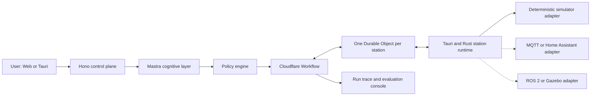
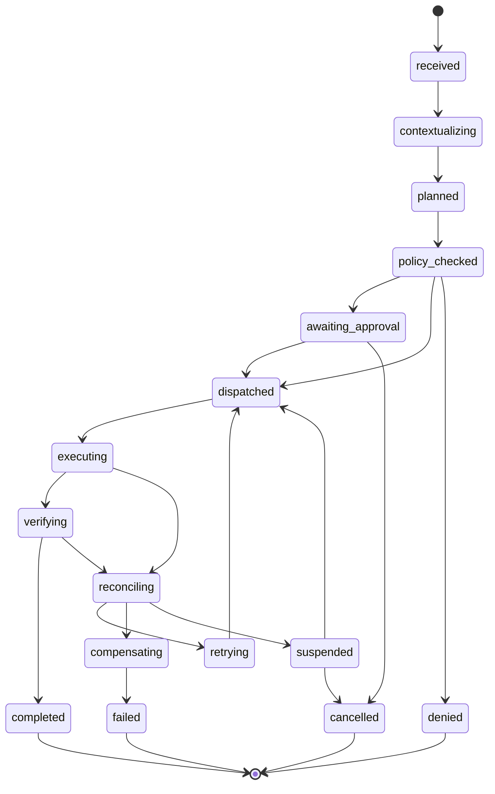

# ErgoPilot project blueprint

Status: implementation in progress; the local Rust command/recovery runtime,
signed policy/approval path, Hono API, optional Mastra planner and TanStack
Start console run end to end

Assumed portfolio schedule: 4–6 weeks

Primary goal: demonstrate production-minded Agent runtime engineering for a
smart ergonomic workstation

## 1. Product thesis

ErgoPilot converts a natural-language work goal into safe, durable and
observable actions across a simulated chair, standing desk and desktop focus
controls.

Example request:

> I am going to code for 90 minutes and my shoulders feel tired. Help me enter
> focus mode. Do not interrupt me unless my posture remains abnormal.

The user should see an explicit plan, policy decisions, device progress and
recovery actions. The model is responsible for interpreting intent and
proposing a plan. Deterministic systems retain authority over permissions,
physical limits, state transitions and execution.

## 2. Portfolio signal

The project is designed to prove the following abilities:

| Hiring signal | Evidence in ErgoPilot |
| --- | --- |
| Device capability abstraction | Versioned capability descriptors and simulator/MQTT/ROS adapters |
| Agent runtime | Typed plans, explicit run state machine, cancellation and recovery |
| Rust and local systems | Tauri station node, async execution, SQLite journal and fault simulation |
| MCP/tool boundaries | Semantic tools, risk metadata and narrow permission scopes |
| Reliable hardware interaction | Idempotency, timeouts, reconciliation and read-after-write verification |
| Human-in-the-loop | Durable approval events with expiry and reason codes |
| Evaluation | Deterministic invariants, fault scenarios, tool-plan datasets and trace review |
| Product judgment | A useful workstation workflow instead of a generic chatbot or framework showcase |

## 3. Scope

### 3.1 First tracer bullet

The first vertical slice must work without an LLM.

1. A hard-coded `TaskSpec` requests a desk-height change; lumbar adjustment is
   added after this first one-action reliability slice.
2. The policy engine requires approval for the desk motion.
3. An approval resumes the run.
4. The command reaches the Rust simulator with an idempotency key and expected
   state version.
5. The runtime emits accepted, executing, uncertain and verified terminal
   events; device adapters may also emit progress.
6. The runtime reads the resulting state before marking the action successful.
7. A web or Tauri view renders the same run as an ordered timeline.
8. Re-sending the command does not repeat the physical effect.
9. Killing and restarting the station process recovers the run from SQLite and
   reconciles the simulated device state.

This is the architecture test. Mastra is added only after this slice is
reliable.

### 3.2 Core MVP

- One workstation and one user.
- A deterministic chair/desk simulator.
- `prepare_focus_session` as the primary workflow.
- Read state, move desk, adjust lumbar support, enable mock focus mode and
  cancel run capabilities.
- Allow, require-approval and deny policy results.
- Device-offline, stale-sensor, actuator-jam, duplicate-command and
  crash-after-effect faults.
- Tauri station node plus a hosted web console.
- Mastra planner producing a validated `TaskSpec`.
- End-to-end trace correlation.
- A small deterministic regression suite and an Agent planning dataset.

### 3.3 Portfolio-complete version

- Three workflows:
  - `prepare_focus_session`
  - `relieve_neck_discomfort`
  - `restore_workstation_profile`
- Multiple saved workstation profiles.
- Run cancellation and compensation.
- Fault-injection lab UI.
- Evaluation dashboard and experiment comparison.
- MQTT/Home Assistant adapter or one small real-device demonstration.

### 3.4 Stretch work

- ROS 2/Gazebo adapter.
- Multiple workstations and remote operator roles.
- Voice input.
- A real pressure sensor or ESP32 actuator.
- Multi-agent orchestration.

### 3.5 Explicit non-goals

- Medical diagnosis or health claims.
- Safety certification for real hardware.
- RAG or a vector database without a concrete retrieval requirement.
- A ChatGPT clone with the workstation attached as a novelty tool.
- Kubernetes or a microservice topology added only for résumé keywords.
- Gazebo before the deterministic execution path is tested.

## 4. System architecture



### 4.1 State ownership

| State | Authoritative owner | Notes |
| --- | --- | --- |
| Physical device state | Local station runtime | Cloud values are observations, never physical truth |
| In-flight device command | Local station runtime | Persisted before side effects |
| High-level task run | Cloudflare Workflow | Owns pause, approval, retry and terminal status |
| Live station connection | Durable Object | Owns connection and pending-delivery coordination |
| Conversation and planning context | Mastra | Never used as the source of task or device truth |
| User policy and profile | Control-plane database | A signed/cached subset is available locally |

### 4.2 Runtime split

The LLM may:

- resolve a user's ambiguous goal;
- select semantic capabilities;
- propose a structured plan;
- ask for missing information;
- explain a policy denial or failure.

The LLM may not:

- emit motor/PWM commands;
- bypass a capability schema;
- choose whether a mandatory approval is needed;
- mutate the run state directly;
- declare success without device-state verification;
- choose blind retries when the physical result is uncertain.

## 5. Domain model

### 5.1 Workstation snapshot

```ts
type WorkstationSnapshot = {
  schemaVersion: 1
  stationId: string
  stateVersion: number
  observedAt: string
  occupied: boolean
  devices: DeviceSnapshot[]
  activeCommandIds: string[]
}
```

An observation older than its capability's allowed freshness window is stale
and cannot satisfy a precondition.

### 5.2 Capability descriptor

```ts
type CapabilityDescriptor = {
  schemaVersion: 1
  id: string
  title: string
  mode: 'read' | 'action'
  risk: 'read' | 'reversible' | 'motion' | 'restricted'
  inputSchema: JsonSchema
  timeoutMs: number
  cancelable: boolean
  freshnessMs?: number
  preconditions: string[]
  verification: VerificationSpec
  compensationCapabilityId?: string
}
```

The initial catalog contains:

- `station.read_snapshot`
- `chair.set_lumbar_support`
- `desk.move_to_height`
- `system.set_focus_mode`
- `run.cancel`

### 5.3 Task specification

```ts
type TaskSpec = {
  schemaVersion: 1
  taskId: string
  goal: 'prepare_focus_session' | 'relieve_neck_discomfort' | 'restore_profile'
  requestedBy: string
  constraints: {
    durationMinutes?: number
    interruptionPolicy?: 'normal' | 'critical-only'
  }
  assumptions: string[]
  steps: PlannedStep[]
}

type PlannedStep = {
  stepId: string
  action: DeviceAction
}
```

The Mastra planner returns only this shape. Schema validation happens before a
workflow is created.

### 5.4 Device command

```ts
type DeviceAction = {
  type: 'desk.move_to_height'
  input: { heightMm: number }
}

type DeviceCommand = {
  schemaVersion: 1
  commandId: string
  taskRunId: string
  action: DeviceAction
  expectedStateVersion: number
  idempotencyKey: string
  expiresAtMs: number
  traceId: string
  policyGrantId: string
}

type PolicyGrant = {
  schemaVersion: 1
  grantId: string
  taskRunId: string
  commandId: string
  action: DeviceAction
  expectedStateVersion: number
  issuedAtMs: number
  expiresAtMs: number
  ruleIds: string[]
  signature: string
}
```

The local slice uses a shared HMAC trust key behind separate issuer and
verifier-only interfaces; the station has no unsigned execution entry point. It
validates schema, signature, validity window, grant ID, task run, command, exact
action and expected state version before any new side effect. Exact replays read
the previously stored outcome even after authorization expiry; they cannot
repeat the effect. A remote control-plane boundary should replace this local
shared-secret model with asymmetric verification and key rotation.

### 5.5 Command event

```ts
type CommandEventType =
  | 'accepted'
  | 'executing'
  | 'outcome_unknown'
  | 'verified_succeeded'
  | 'verification_failed'
  | 'execution_failed'
  | 'reconciliation_pending'
  | 'reconciled_succeeded'

type CommandEvent = {
  sequence: number
  commandId: string
  eventType: CommandEventType
  atMs: number
}
```

This initial event envelope is deliberately closed and JSON-tested. Progress,
cancellation and structured error payloads extend it alongside the task runtime
rather than entering the journal as arbitrary strings.

### 5.6 Policy decision

```ts
type PolicyDecision = {
  outcome: 'allow' | 'require_approval' | 'deny'
  ruleIds: string[]
  reasonCode?: string
}
```

Approval identity, expiry and status are durable fields on `TaskRunView`; a
policy decision is evidence for why a run was allowed, paused or denied. The
current view also carries the validated `TaskSpec`, so a browser reload can
still explain the exact action and constraints under approval.

## 6. Deep module interfaces

The device layer exposes a small interface and hides transport-specific
behavior behind adapters.

```ts
interface CapabilityRuntime {
  catalog(): Promise<CapabilityDescriptor[]>
  start(command: DeviceCommand): Promise<CommandHandle>
  events(commandId: string): AsyncIterable<CommandEvent>
  cancel(commandId: string): Promise<CancelResult>
}
```

Production and tests use different adapters across the same seam:

- deterministic simulator adapter;
- MQTT/Home Assistant adapter;
- optional ROS 2 adapter;
- in-memory adapter for orchestration tests.

The orchestration layer exposes another small interface:

```ts
interface TaskRuntime {
  start(task: TaskSpec): Promise<TaskRun>
  approve(runId: string, approvedBy: string, nowMs: number): Promise<TaskRunView>
  reconcile(runId: string, nowMs: number): Promise<TaskRunView>
  inspect(runId: string): Promise<TaskRunView>
  stationSnapshot(observedAtMs: number): Promise<WorkstationSnapshot>
}
```

## 7. Task state machine



### 7.1 Invariants

These are target invariants for the complete MVP. The current local slice now
enforces TaskSpec validation, grant authenticity, validity,
task/command/action/state-precondition scope, approval ownership and expiry,
task idempotency, stale-plan suspension and task-level reconciliation across
both dispatch crash windows. Cancellation and compensation remain future
slices.

1. Every device command belongs to an existing task run.
2. Every action command carries a non-expired policy grant.
3. The local runtime validates the schema and policy envelope again.
4. A stale `expectedStateVersion` is rejected before a side effect.
5. A command record is durably persisted before execution begins.
6. Duplicate idempotency keys return the existing outcome.
7. A timeout with an uncertain physical outcome enters reconciliation, not a
   blind retry.
8. Success requires post-action state verification.
9. Compensation is not automatic if the physical state is unknown.
10. Cancellation is a state transition with an observable result, not a UI-only
    event.

## 8. Error taxonomy

| Error | Retry behavior | Required action |
| --- | --- | --- |
| `validation_error` | Never | Fix caller or schema |
| `policy_denied` | Never | Explain denial or change policy explicitly |
| `approval_expired` | Never automatically | Request a new approval |
| `stale_state` | After refreshing state | Re-plan if assumptions changed |
| `device_unavailable` | Bounded backoff | Suspend after retry budget |
| `command_timeout` | Do not blindly retry | Reconcile actual device state |
| `actuator_fault` | Device-specific | Stop, verify and possibly compensate |
| `transport_interrupted` | Resume delivery | Preserve command identity |
| `runtime_restarted` | Recover from journal | Reconcile all non-terminal commands |

## 9. Simulator

### 9.1 Simulated state

- Occupancy sensor.
- Four-zone seat-pressure readings.
- Chair lumbar-support position.
- Chair recline angle.
- Desk height and velocity.
- Actuator health and temperature.
- Mock OS focus mode.

All numeric ranges are simulator configuration, not medical guidance.

### 9.2 Fault injection

- `device_offline`
- `sensor_stale`
- `actuator_jam_at_percent`
- `ack_delay_ms`
- `duplicate_delivery`
- `out_of_order_event`
- `crash_before_effect`
- `crash_after_effect_before_ack`

The simulator accepts a seed so every fault scenario is reproducible in tests
and demonstrations.

## 10. UI information architecture

### 10.1 Routes

- `/stations/:stationId` — live workstation and active run
- `/runs/:runId` — immutable run timeline, tool calls and recovery evidence
- `/lab` — simulator controls and fault injection
- `/evals` — datasets, experiment runs and regressions
- `/settings/policies` — user safety envelope and approval preferences

### 10.2 Primary screen

```text
┌──────── station connection · safety · active profile ────────┐
│                                                               │
│  Workstation twin                  Agent copilot               │
│  chair / desk / pressure           intent + explanation        │
│                                                               │
│  Current TaskSpec and policy decision                          │
│  planned → approval → dispatched → executing → verifying       │
│                                                               │
│  Run timeline                       capability / trace inspector│
└───────────────────────────────────────────────────────────────┘
```

### 10.3 UI ownership

Use shadcn/ui as the base design system. Add selected AI Elements only when a
screen is rendering model-generated structured content or actual AI SDK message
or tool parts:

| Need | UI implementation |
| --- | --- |
| AI explanation | AI Elements `MessageResponse` |
| User input | shadcn/ui `Textarea` for the current text-only request |
| Semantic plan | AI Elements `Task` |
| Tool state | AI Elements `Tool` with domain labels |
| Deterministic human approval | shadcn/ui `AlertDialog` wired to task state |
| AI-initiated tool confirmation | AI Elements `Confirmation` after AI SDK integration |
| Pending work | AI Elements `Queue` |
| Recovery marker | AI Elements `Checkpoint` |
| Device visualization | Custom `WorkstationTwin` |
| Run lifecycle | Custom `RunTimeline` |
| Policy evidence | Custom `PolicyDecisionCard` |
| Physical command | Custom `DeviceCommandCard` |

Do not display private chain-of-thought. Render concise decision summaries,
policy rule identifiers and observable tool/run events.

assistant-ui is deferred. If multi-thread conversation management becomes a
real requirement, it may own chat state only; task and device state remain in
their existing authoritative systems.

The current console uses AI Elements `Task` for the model-generated structured
plan and shadcn/ui for the text-only input and deterministic approval. The
richer `PromptInput` is deferred until attachments or model selection are real
requirements; assistant-ui remains unnecessary for this task-first surface.

## 11. Repository layout

```text
ergopilot/
├── apps/
│   ├── station-cli/         # executable recovery and approval demos
│   ├── web/                 # current TanStack Start operator console
│   ├── control-plane/       # Hono, Mastra and station process adapter
│   └── station/             # Tauri application
├── crates/
│   ├── ergopilot-protocol/  # versioned cross-runtime JSON types
│   ├── policy-core/         # decisions, grant signing and verification
│   ├── task-runtime/        # durable task/approval state and recovery
│   ├── station-core/        # device command state machine and journal
│   ├── device-sim/          # deterministic simulator
│   └── device-mqtt/         # later adapter
├── packages/
│   ├── contracts/           # current Zod schemas and TypeScript types
│   ├── domain-ui/           # custom workstation/run components
│   ├── ui/                  # shadcn and selected AI Elements source
│   └── evals/               # datasets and scorers
├── docs/
│   ├── PROJECT_BLUEPRINT.md
│   └── adr/
└── infra/
    └── cloudflare/
```

Use a pnpm workspace for TypeScript and a Cargo workspace for Rust. Add a build
orchestration tool only after plain workspace scripts become insufficient.

## 12. Implementation sequence

### Week 1 — protocol and deterministic core

- Define versioned JSON schemas.
- Generate or validate TypeScript and Rust representations.
- Implement the Rust simulator.
- Implement command idempotency and the action state machine.
- Add deterministic unit and property tests.

Exit criterion: the tracer bullet runs in-process without cloud or LLM code.

### Week 2 — local runtime and recovery

- Add SQLite command/event journal.
- Implement startup reconciliation.
- Create the Tauri station shell.
- Stream simulator events into the operator view.
- Demonstrate `crash_after_effect_before_ack` recovery.

Exit criterion: killing and restarting the station cannot duplicate an effect
or lose the final outcome.

### Week 3 — control plane and remote coordination

- Scaffold the Hono control plane.
- Add one Durable Object per station.
- Implement the outbound station WebSocket and reconnect protocol.
- Add pending command expiry and redelivery.
- Create the first hosted console screen.

Exit criterion: the web console can run the same hard-coded `TaskSpec` against
the local simulator.

Current milestone: this exit criterion is met through a local Hono-to-Rust JSON
process adapter. The API is bound to loopback while approval identity remains a
local demo assertion. Authentication, the Durable Object, outbound station
WebSocket and hosted deployment remain the next remote-coordination slice.

### Week 4 — durable workflow and Agent planner

- Implement the Cloudflare Workflow state machine.
- Add approval signals and expiry.
- Add the Mastra planner and strict `TaskSpec` validation.
- Convert Mastra output to an AI SDK UI stream.
- Render selected AI Elements in the copilot panel.

Exit criterion: the primary natural-language demo completes and survives a
browser reload, control-plane restart and station reconnect.

Current milestone: the local Mastra planner can use an explicitly selected,
key-enabled OpenAI or DeepSeek provider to produce an atomically validated
single-step `TaskSpec`. The user must confirm it before the existing policy and
approval runtime begins. Durable cloud workflow, streaming explanation and
station reconnect remain future slices.

### Week 5 — observability and evaluation

- Correlate `traceId`, `taskRunId`, `commandId` and `stationId`.
- Build the immutable run timeline.
- Add deterministic safety gates to CI.
- Create the Agent planning dataset and tool-call scorer.
- Add the fault-injection lab.

Exit criterion: every success and failure in the demo has inspectable evidence.

Current milestone: the Hono control plane exposes the latest 100 process-local
attempts for schema-valid planning requests, with trace ID, provider/model,
duration, outcome, task ID and stable error code. Prompts, user identifiers and
credentials are excluded. A deterministic scorer and six-case seed dataset now
cover exact English/Chinese intent extraction, safety boundaries and an unsafe
request; the initial live DeepSeek run passed 6/6 cases. Persistent export,
request-validation telemetry, expansion to 30–50 cases and tool-call scoring
remain future slices.

### Week 6 — portfolio polish and one integration

- Add MQTT/Home Assistant or a small physical device.
- Write architecture decisions and failure-model documentation.
- Record a 2–3 minute demo.
- Run and publish measured evaluation results.
- Convert measured results into résumé bullets.

## 13. Work tickets

| Order | Ticket | Depends on | Done when |
| --- | --- | --- | --- |
| 1 | Bootstrap pnpm and Cargo workspaces | — | TypeScript and Rust checks run from root |
| 2 | Define protocol schemas | 1 | Schemas cover snapshot, task, command, event and policy |
| 3 | Implement deterministic simulator | 2 | Seeded state transition and faults are repeatable |
| 4 | Implement station command runtime | 2, 3 | Idempotency, stale-state rejection and verification pass |
| 5 | Persist journal and recover | 4 | Crash-after-effect test passes |
| 6 | Add Tauri station shell | 4, 5 | Live state and events are visible |
| 7 | Implement Hono station API | 2 | OpenAPI contract and auth middleware exist |
| 8 | Add Durable Object session | 7 | Reconnect and redelivery tests pass |
| 9 | Add durable Task Workflow | 7, 8 | Approval, expiry, cancel and resume pass |
| 10 | Add Mastra TaskSpec planner | 2, 9 | Invalid or unsafe plans cannot start a run |
| 11 | Build console vertical slice | 6–10 | Prompt-to-verified-action demo works |
| 12 | Add traces and evaluation suite | 3–11 | Acceptance gates run in CI |
| 13 | Add MQTT/Home Assistant adapter | 4, 12 | Same capability contract controls second adapter |

## 14. Acceptance gates

These are pre-declared targets, not résumé claims until measured.

### 14.1 Deterministic safety

- Zero out-of-envelope commands across at least 200 generated test cases.
- Duplicate delivery never produces a second physical effect.
- Stale state versions are rejected before execution.
- Every reported success includes a matching verified state observation.
- Every non-terminal command is reconciled after restart.
- An expired approval cannot authorize a command.

### 14.2 Fault recovery

- The five Core MVP faults have deterministic regression cases.
- The primary workflow reaches a safe terminal or suspended state for every
  injected fault.
- Recovery time and number of retries are recorded.
- Unknown physical outcomes never trigger blind retries.

### 14.3 Agent quality

- Create 30–50 intent cases with expected goal, constraints, required tools and
  forbidden actions.
- Measure schema validity, tool-selection accuracy, unnecessary approval rate
  and forbidden-action rate.
- Use LLM-based scoring only for plan usefulness and explanation quality.
- Enforce safety with deterministic assertions rather than a judge model.

## 15. Demonstration script

1. Open the web console while the Tauri station is connected.
2. Enter the 90-minute focus-session request.
3. Show the generated `TaskSpec` and the rules that trigger desk-motion
   approval.
4. Approve once and watch chair/desk progress in the digital twin.
5. Inject an actuator jam at 60 percent.
6. Show timeout, reconciliation and a safe suspended state.
7. Clear the fault and resume the workflow.
8. During a second command, kill the station after the simulated physical
   effect but before its ACK.
9. Restart the station and show journal replay plus state verification without
   a duplicate movement.
10. Open the run page and inspect the correlated trace and evaluation result.

## 16. Architecture decisions to document

- ADR-001: the LLM plans but does not execute physical actions directly.
- ADR-002: cloud workflow owns the task; the local state machine owns device
  execution.
- ADR-003: one Durable Object represents one workstation coordination unit.
- ADR-004: AI Elements are used selectively; assistant-ui is deferred.
- ADR-005: the deterministic simulator precedes MQTT and ROS 2 integrations.
- ADR-006: at-least-once delivery plus idempotent effects instead of an
  exactly-once claim.

## 17. Metrics to collect for the résumé

- Number of deterministic protocol and property-test cases.
- Number of fault scenarios and successful recoveries.
- Agent planning dataset size and tool-selection accuracy.
- Forbidden-action count.
- Median and p95 command acknowledgement/recovery latency.
- Percentage of runs with complete trace correlation.
- Number of adapters satisfying the same capability interface.

Do not put target values on the résumé. Replace them with measured results after
the final evaluation run.
